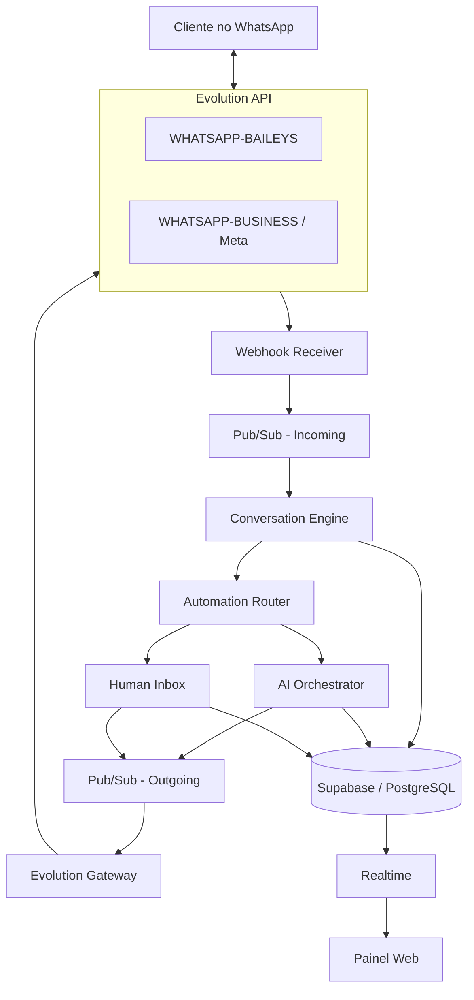
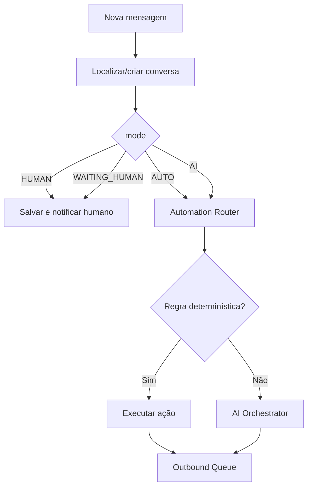

# Plano de Execução — Plataforma SaaS de Atendimento e Automação no WhatsApp com IA

**Documento para execução por etapas no Codex**  
**Data de referência:** 17/09/2026  
**Arquitetura principal:** TypeScript / Node.js / NestJS + Supabase/PostgreSQL + Google Cloud + Evolution API  
**Canal inicial:** WhatsApp  
**Provedores WhatsApp:** Evolution API com `WHATSAPP-BAILEYS` e `WHATSAPP-BUSINESS`

---

## 1. Objetivo do produto

Construir uma plataforma SaaS independente, multiempresa e multiusuário, para atendimento e automação no WhatsApp.

Cada estabelecimento poderá:

1. criar sua conta e organização;
2. adicionar usuários/atendentes;
3. conectar um ou mais números de WhatsApp;
4. escolher entre:
   - **Conexão rápida por QR Code**, via Evolution API + Baileys;
   - **API oficial da Meta**, via Evolution API + WhatsApp Cloud API;
5. receber todas as conversas em uma caixa de entrada central;
6. deixar o atendimento inicialmente com bot/automação/IA;
7. transferir a conversa para uma pessoa quando o cliente pedir ou quando as regras exigirem;
8. permitir que o atendente devolva a conversa para a IA;
9. configurar personalidade, instruções, horários e base de conhecimento da IA;
10. futuramente conectar sistemas externos, incluindo o Entregaí.

A Evolution API deve ser tratada como **gateway/camada de transporte do WhatsApp**.

A Evolution API **não deve ser o banco principal da plataforma**, nem deve controlar as regras de negócio, a IA, os usuários, as organizações, a cobrança ou a verdade das conversas.

---

# 2. Princípios obrigatórios de arquitetura

## 2.1. Multi-tenant desde o primeiro commit

Toda entidade pertencente a uma empresa deve possuir `organization_id`.

Nenhum endpoint pode confiar em `organization_id` recebido arbitrariamente do frontend.

O `organization_id` deve ser resolvido pelo usuário autenticado e pelas memberships autorizadas.

Exemplos:

- WhatsApp Connections
- Contacts
- Conversations
- Messages
- AI Agents
- Knowledge Base
- Teams
- Automations
- Integrations
- Usage
- Billing

devem ser isolados por organização.

---

## 2.2. Uma conexão lógica por número de WhatsApp

Cada número conectado será representado por um registro interno:

```text
whatsapp_connection
```

e possuirá uma instância correspondente na Evolution API.

Exemplo:

```text
Organização: Restaurante Exemplo

WhatsApp Pedidos
connection_id: wac_01
evolution_instance_name: org_a81c_wac_01
provider: EVOLUTION_BAILEYS

WhatsApp Reservas
connection_id: wac_02
evolution_instance_name: org_a81c_wac_02
provider: EVOLUTION_META
```

Regra:

```text
1 número de WhatsApp
=
1 whatsapp_connection da nossa plataforma
=
1 instance da Evolution API
```

Isso **não significa 1 VM por WhatsApp**.

Várias instâncias da Evolution devem coexistir na mesma infraestrutura.

---

## 2.3. A aplicação nunca deve conversar diretamente com Baileys

Não implementar Baileys dentro do backend principal.

O fluxo deve ser:

```text
Nossa aplicação
      ↓
Evolution API
      ↓
Baileys ou Meta
      ↓
WhatsApp
```

Isso reduz o acoplamento e permite trocar a implementação de transporte no futuro.

---

## 2.4. Abstração interna de provedor

Mesmo utilizando Evolution para ambos os tipos de conexão, criar uma abstração interna:

```ts
interface WhatsAppGateway {
  createConnection(...)
  connect(...)
  getConnectionState(...)
  disconnect(...)
  deleteConnection(...)

  sendText(...)
  sendMedia(...)
  markAsRead(...)
}
```

Implementação inicial:

```text
EvolutionWhatsAppGateway
```

A camada de domínio não deve importar diretamente o client HTTP da Evolution.

---

## 2.5. Evolution API não controla nossa IA

Não utilizar EvoAI, OpenAI Bot, Typebot ou qualquer outro bot nativo da Evolution no MVP.

A Evolution terá somente as responsabilidades:

- conectar o número;
- receber eventos do WhatsApp;
- entregar webhook para nossa aplicação;
- enviar mensagens;
- enviar mídia;
- informar estado da conexão;
- fornecer QR Code;
- servir de ponte para a API oficial da Meta.

Toda IA fica em nossa aplicação.

---

# 2.6. Estratégia operacional para Baileys e migração de provider

A conexão `EVOLUTION_BAILEYS` existe para oferecer onboarding simples por QR Code e menor custo direto de mensageria, mas deve ser tratada como uma integração **não oficial do WhatsApp**, com risco operacional superior ao da API oficial.

## 2.6.1. Regras de adoção do Baileys

1. **Não utilizar um número crítico como primeiro teste.**  
   Em homologação e nos primeiros testes reais, utilizar um número secundário ou um número cuja indisponibilidade temporária não comprometa a operação do estabelecimento.

2. **Não utilizar a plataforma para spam ou disparos massivos não solicitados.**  
   O caso de uso prioritário é atendimento reativo, iniciado pelo cliente, automação de suporte e execução de fluxos autorizados. O fato de a conexão ocorrer via Baileys não remove riscos técnicos, contratuais ou de bloqueio.

3. **Toda conexão Baileys deve ser migrável para Meta oficial.**  
   Uma organização deve conseguir trocar de `EVOLUTION_BAILEYS` para `EVOLUTION_META` sem perder dados da plataforma.

A aplicação deve comunicar claramente ao estabelecimento que:

```text
EVOLUTION_BAILEYS
- conexão por QR Code;
- não é a API oficial do WhatsApp;
- pode exigir reconexão;
- pode sofrer incompatibilidades após mudanças do WhatsApp;
- possui risco operacional superior.

EVOLUTION_META
- utiliza a API oficial;
- possui onboarding e credenciais Meta;
- segue políticas e cobrança aplicáveis da Meta;
- deve ser a opção preferencial para operações que exigem maior previsibilidade.
```

## 2.6.2. Migração Baileys → Meta sem perda de dados

A troca de provider é uma alteração da **camada de transporte**, e não uma migração do domínio da plataforma.

Devem permanecer intactos:

```text
organizations
organization_members
contacts
conversations
messages
conversation_assignments
ai_agents
ai_agent_settings
knowledge_sources
knowledge_chunks
automations
teams
usage_events
audit_logs
```

A migração deve substituir somente os elementos ligados à conexão/transporte, como:

```text
whatsapp_connection.provider
evolution_instance_name / evolution_instance_id
credenciais/referências de secrets
metadados específicos do provider
estado da conexão
```

Fluxo conceitual:

```text
EVOLUTION_BAILEYS
       │
       │ iniciar migração
       ▼
bloquear alterações concorrentes na connection
       │
       ▼
provisionar EVOLUTION_META
       │
       ▼
validar conexão oficial
       │
       ▼
trocar provider ativo
       │
       ▼
desativar/remover instância Baileys antiga
       │
       ▼
manter todo o histórico e configurações da plataforma
```

A operação deve ser auditada e idempotente. Em caso de falha antes da ativação da conexão oficial, a conexão anterior não deve ser removida automaticamente.

## 2.6.3. Independência futura da Evolution para Meta

No MVP, tanto Baileys quanto Meta passam pela Evolution API:

```text
Nossa aplicação
      ↓
EvolutionWhatsAppGateway
      ↓
Evolution API
   ┌──┴──┐
Baileys  Meta
```

Entretanto, a interface `WhatsAppGateway` deve permitir futuramente uma implementação direta:

```text
MetaCloudWhatsAppGateway
```

sem alterar Conversation Engine, Inbox, IA, Contacts, Automations ou integrações de negócio.

Não implementar esse gateway direto no MVP sem necessidade concreta.

---

# 3. Arquitetura de alto nível



---

# 4. Topologia recomendada no Google Cloud

## 4.1. Backend principal

Usar **Cloud Run** para:

- API NestJS;
- webhook receiver;
- Conversation Engine;
- AI Orchestrator;
- API para frontend;
- consumers stateless.

Serviços podem começar agrupados em um único deploy NestJS e serem separados quando houver necessidade operacional.

Não criar microserviços apenas por estética.

---

## 4.2. Evolution API

No MVP:

```text
Google Compute Engine
└── Docker Compose
    ├── Evolution API
    ├── PostgreSQL Evolution
    └── Redis Evolution
```

A Evolution API recomenda Docker para produção e utiliza banco PostgreSQL/MySQL e Redis.

A aplicação principal **não deve compartilhar as tabelas internas da Evolution**.

Preferência:

```text
Banco da plataforma: Supabase/PostgreSQL
Banco da Evolution: PostgreSQL exclusivo da Evolution
Redis Evolution: exclusivo ou namespace claramente isolado
```

Em uma fase posterior, banco e Redis da Evolution podem ser migrados para serviços gerenciados.

---

## 4.3. Mensageria

Usar Google Cloud Pub/Sub.

Tópicos iniciais:

```text
whatsapp-inbound
whatsapp-outbound
whatsapp-events
ai-jobs
dead-letter
```

Objetivo:

- responder webhooks rapidamente;
- não executar IA dentro da requisição do webhook;
- suportar retries;
- suportar crescimento;
- desacoplar recebimento, interpretação e envio.

---

## 4.4. Segredos

Usar Google Secret Manager para:

- `EVOLUTION_API_KEY`
- tokens de serviço;
- chaves de criptografia;
- secrets do webhook;
- credenciais Meta que eventualmente precisarem existir na aplicação;
- tokens do provedor de IA.

Nunca salvar segredo em:

- frontend;
- repositório;
- localStorage;
- logs;
- tabelas sem criptografia.

---

# 5. Estrutura sugerida do projeto

Se for um projeto novo, preferir monorepo.

```text
/
├── apps/
│   ├── web/
│   ├── api/
│   └── workers/
│
├── packages/
│   ├── domain/
│   ├── database/
│   ├── evolution-client/
│   ├── whatsapp/
│   ├── conversations/
│   ├── automations/
│   ├── ai/
│   ├── shared/
│   └── observability/
│
├── infra/
│   ├── evolution/
│   │   ├── docker-compose.yml
│   │   └── .env.example
│   ├── gcp/
│   └── scripts/
│
├── docs/
│   ├── architecture.md
│   ├── evolution.md
│   ├── webhooks.md
│   └── runbook.md
│
└── README.md
```

Se já houver estrutura definida no repositório, o Codex deve preservar as convenções existentes em vez de reorganizar tudo sem necessidade.

---

# 6. Modelo de dados principal

Os nomes podem ser adaptados às convenções do projeto, mas o modelo conceitual deve ser preservado.

---

## 6.1. organizations

```text
id uuid pk
name text
slug text unique
status enum(active, suspended, cancelled)
timezone text
created_at timestamptz
updated_at timestamptz
```

---

## 6.2. organization_members

```text
id uuid pk
organization_id uuid fk
user_id uuid fk
role enum(owner, admin, supervisor, agent)
status enum(active, invited, disabled)
created_at
```

Não colocar papel da organização diretamente na tabela global de usuário.

Um usuário pode futuramente fazer parte de mais de uma organização.

---

## 6.3. teams

```text
id
organization_id
name
created_at
```

---

## 6.4. team_members

```text
team_id
member_id
```

---

## 6.5. whatsapp_connections

```text
id uuid pk
organization_id uuid fk

name text
phone_number text nullable
display_name text nullable

provider enum(
  EVOLUTION_BAILEYS,
  EVOLUTION_META
)

evolution_instance_name text unique
evolution_instance_id text nullable

status enum(
  CREATED,
  CONNECTING,
  QR_PENDING,
  CONNECTED,
  DISCONNECTED,
  ERROR,
  DELETED
)

is_ai_enabled boolean default true
default_team_id uuid nullable

last_connected_at timestamptz nullable
last_disconnected_at timestamptz nullable
last_error_code text nullable
last_error_message text nullable

created_at
updated_at
```

Tokens Meta não devem ficar diretamente nesta tabela em plaintext.

---

## 6.6. whatsapp_connection_secrets

Armazenar apenas se realmente necessário.

Preferência por referências ao Secret Manager.

```text
id
connection_id
secret_type
secret_reference
created_at
updated_at
```

---

## 6.7. contacts

```text
id
organization_id
phone_number
name
profile_picture_url nullable
metadata jsonb
created_at
updated_at
```

Criar unique composto:

```text
organization_id + phone_number
```

Não assumir que o mesmo telefone é o mesmo contato entre organizações diferentes.

---

## 6.8. conversations

```text
id
organization_id
whatsapp_connection_id
contact_id

status enum(
  OPEN,
  CLOSED,
  ARCHIVED
)

mode enum(
  AUTO,
  AI,
  WAITING_HUMAN,
  HUMAN
)

assigned_member_id uuid nullable
assigned_team_id uuid nullable

ai_agent_id uuid nullable

last_message_at timestamptz
last_customer_message_at timestamptz nullable
last_agent_message_at timestamptz nullable

unread_count int default 0

ai_summary text nullable
ai_state jsonb default '{}'

created_at
updated_at
closed_at nullable
```

### Regra crítica

Se:

```text
mode = HUMAN
```

ou:

```text
mode = WAITING_HUMAN
```

a IA **não pode enviar mensagens**.

Isso deve ser garantido no código, e não apenas no prompt.

---

## 6.9. messages

```text
id uuid pk
organization_id
conversation_id
whatsapp_connection_id

external_message_id text nullable
provider_message_id text nullable

direction enum(INBOUND, OUTBOUND)

sender_type enum(
  CUSTOMER,
  AI,
  AUTOMATION,
  HUMAN,
  SYSTEM
)

sender_member_id uuid nullable

type enum(
  TEXT,
  IMAGE,
  AUDIO,
  VIDEO,
  DOCUMENT,
  LOCATION,
  CONTACT,
  INTERACTIVE,
  UNKNOWN
)

text_content text nullable
payload jsonb

status enum(
  RECEIVED,
  QUEUED,
  PROCESSING,
  SENT,
  DELIVERED,
  READ,
  FAILED
)

reply_to_message_id uuid nullable

provider_timestamp timestamptz nullable
created_at
updated_at
```

Criar índice/idempotência usando:

```text
whatsapp_connection_id + external_message_id
```

quando `external_message_id` estiver disponível.

---

## 6.10. message_attachments

```text
id
message_id
storage_path
mime_type
file_name
size_bytes
duration_ms nullable
metadata jsonb
```

---

## 6.11. conversation_assignments

Histórico de handoff.

```text
id
conversation_id
from_mode
to_mode
assigned_member_id nullable
reason
created_by_type enum(AI, AUTOMATION, HUMAN, SYSTEM)
created_by_member_id nullable
created_at
```

---

## 6.12. ai_agents

```text
id
organization_id
name
enabled
model_provider
model_name
system_instructions
temperature
fallback_message
created_at
updated_at
```

Não colocar token do provedor aqui.

---

## 6.13. ai_agent_settings

```text
ai_agent_id
welcome_message
tone
business_hours_behavior
human_handoff_enabled
handoff_on_explicit_request
handoff_on_low_confidence
handoff_on_complaint
max_consecutive_failures
response_delay_ms
metadata jsonb
```

---

## 6.14. knowledge_sources

```text
id
organization_id
ai_agent_id
type enum(TEXT, URL, DOCUMENT, FAQ, INTEGRATION)
title
status
source_metadata jsonb
created_at
updated_at
```

---

## 6.15. knowledge_chunks

Para RAG futuro:

```text
id
source_id
organization_id
content
embedding
metadata jsonb
```

Garantir filtro obrigatório por `organization_id`.

---

## 6.16. automations

```text
id
organization_id
name
enabled
trigger_type
conditions jsonb
actions jsonb
priority
created_at
updated_at
```

---

## 6.17. processed_webhook_events

Essencial para idempotência.

```text
id
provider
event_key unique
event_type
payload_hash
processed_at
created_at
```

---

## 6.18. usage_events

Base para cobrança futura.

```text
id
organization_id
connection_id nullable
conversation_id nullable

type enum(
  AI_INPUT_TOKENS,
  AI_OUTPUT_TOKENS,
  AI_CALL,
  TRANSCRIPTION_SECONDS,
  WHATSAPP_MESSAGE_SENT,
  WHATSAPP_TEMPLATE_SENT,
  STORAGE_BYTES
)

quantity numeric
unit_cost nullable
metadata jsonb
created_at
```

---

## 6.19. audit_logs

```text
id
organization_id
actor_type
actor_user_id nullable
action
resource_type
resource_id
metadata jsonb
ip nullable
created_at
```

Registrar:

- criação/exclusão de conexão;
- troca de provedor;
- assunção de conversa;
- devolução para IA;
- mudança de configuração do agente;
- alteração de permissões;
- eventos administrativos relevantes.

---

# 7. RLS e isolamento multi-tenant

Se Supabase for utilizado, configurar Row Level Security em todas as tabelas multi-tenant.

Regras obrigatórias:

1. frontend nunca utiliza `service_role`;
2. frontend acessa apenas organizações das quais o usuário é membro;
3. `owner/admin` podem gerenciar usuários e conexões;
4. `agent` vê apenas recursos permitidos pela organização;
5. operações sensíveis passam pelo backend;
6. jobs internos usam credencial de serviço somente no servidor.

Criar testes automatizados de isolamento:

```text
Usuário Org A não consegue:
- listar mensagens Org B
- consultar conexão Org B
- assumir conversa Org B
- enviar mensagem Org B
- acessar agente Org B
```

---

# 8. Integração com Evolution API

## 8.1. Client dedicado

Criar:

```text
packages/evolution-client
```

Responsabilidade:

- autenticação `apikey`;
- timeouts;
- retries seguros;
- serialização;
- tratamento de erro;
- logs sem segredos;
- tipagem dos requests/responses.

Variáveis:

```env
EVOLUTION_BASE_URL=
EVOLUTION_API_KEY=
EVOLUTION_WEBHOOK_SECRET=
```

Nunca chamar Evolution diretamente do browser.

---

# 9. Fluxo — conexão por QR Code

## 9.1. Criar connection interna

Frontend:

```http
POST /v1/whatsapp/connections
```

Body:

```json
{
  "name": "Pedidos",
  "provider": "EVOLUTION_BAILEYS"
}
```

Backend:

1. valida organização e permissão;
2. cria `whatsapp_connections`;
3. gera `evolution_instance_name`;
4. chama Evolution;
5. configura webhook;
6. retorna connection.

---

## 9.2. Criar instância Evolution

Evolution:

```http
POST /instance/create
apikey: <SECRET>
```

Payload conceitual:

```json
{
  "instanceName": "org_a81c_wac_01",
  "qrcode": true,
  "integration": "WHATSAPP-BAILEYS",
  "webhook": {
    "enabled": true,
    "url": "https://api.example.com/webhooks/evolution",
    "events": [
      "QRCODE_UPDATED",
      "CONNECTION_UPDATE",
      "MESSAGES_UPSERT",
      "MESSAGES_UPDATE",
      "SEND_MESSAGE"
    ]
  }
}
```

Os nomes exatos dos campos devem sempre ser confirmados contra a versão instalada da Evolution.

---

## 9.3. Obter QR Code

Evolution:

```http
GET /instance/connect/{instanceName}
```

A resposta pode conter:

```text
pairingCode
code
base64
count
```

A API interna deve devolver apenas os dados necessários ao frontend.

Nunca devolver a API key da Evolution.

---

## 9.4. Estado da conexão

Evolution:

```http
GET /instance/connectionState/{instanceName}
```

Nossa API:

```http
GET /v1/whatsapp/connections/{connectionId}/status
```

O frontend não consulta a Evolution diretamente.

---

# 10. Fluxo — conexão oficial Meta

A Evolution API também será utilizada para a API oficial.

Provider interno:

```text
EVOLUTION_META
```

Evolution:

```text
integration = WHATSAPP-BUSINESS
```

Payload conceitual:

```json
{
  "instanceName": "org_a81c_wac_02",
  "token": "<META_PERMANENT_TOKEN>",
  "number": "<WHATSAPP_NUMBER_ID>",
  "businessId": "<WHATSAPP_BUSINESS_ACCOUNT_ID>",
  "qrcode": false,
  "integration": "WHATSAPP-BUSINESS"
}
```

## Regras

- token deve ser enviado apenas backend → Evolution;
- não armazenar token bruto no frontend;
- usar Secret Manager quando a aplicação precisar persistir a referência;
- auditar criação e alteração da integração.

A documentação atual da Evolution orienta a Meta a entregar seus eventos para:

```text
EVOLUTION_BASE_URL/webhook/meta
```

A Evolution passa a gerenciar as mensagens relacionadas à instância oficial.

---

# 11. Webhook da Evolution para nossa aplicação

Endpoint único:

```http
POST /webhooks/evolution
```

Configurar por instância.

Adicionar um header secreto customizado se a versão instalada permitir:

```text
X-Webhook-Secret: <secret>
```

Validar o segredo antes de aceitar o payload.

---

## 11.1. Eventos iniciais que devemos consumir

```text
QRCODE_UPDATED
CONNECTION_UPDATE
MESSAGES_UPSERT
MESSAGES_UPDATE
SEND_MESSAGE
```

Não ativar todos os eventos apenas porque existem.

Evitar inicialmente:

```text
MESSAGES_SET
CONTACTS_SET
CHATS_SET
```

quando não forem necessários, pois sincronizações completas podem gerar grande volume.

---

## 11.2. Regra do receiver

O endpoint de webhook deve fazer apenas:

```text
receber
→ autenticar
→ validar minimamente
→ calcular chave de idempotência
→ publicar no Pub/Sub
→ responder 2xx
```

Não fazer:

```text
webhook
→ chamar Gemini
→ aguardar resposta
→ enviar WhatsApp
→ responder webhook
```

---

# 12. Normalização dos eventos

Criar um formato interno único.

Exemplo:

```ts
type NormalizedInboundMessage = {
  eventId: string
  connectionId: string
  organizationId: string

  externalMessageId: string

  from: {
    phone: string
    name?: string
  }

  type:
    | 'text'
    | 'image'
    | 'audio'
    | 'video'
    | 'document'
    | 'location'
    | 'contact'
    | 'unknown'

  content: {
    text?: string
    mediaUrl?: string
    mimeType?: string
    caption?: string
    raw?: unknown
  }

  timestamp: string
}
```

Todo o sistema posterior trabalha apenas com o formato normalizado.

Nunca permitir que o Conversation Engine dependa do JSON bruto da Evolution.

---

# 13. Idempotência

Webhooks podem ser reenviados.

Uma mensagem nunca pode:

- aparecer duas vezes;
- chamar IA duas vezes;
- gerar duas respostas;
- gerar dois pedidos.

Criar chave de idempotência preferencial:

```text
connection_id + provider_message_id
```

e fallback seguro quando necessário.

Antes de processar:

```text
event já processado?
  sim → ACK e ignorar
  não → registrar + processar
```

---

# 14. Ordenação e concorrência

Problema real:

```text
Cliente:
"quero"
"uma pizza"
"grande"
"de calabresa"
```

Essas mensagens podem chegar muito próximas.

Não permitir quatro respostas concorrentes da IA.

Implementar:

```text
lock por conversation_id
```

e uma pequena janela de debounce configurável.

Inicial:

```text
1.5s a 3s
```

Fluxo:

```text
mensagem chega
→ persistir
→ esperar debounce
→ juntar mensagens ainda não processadas
→ executar Conversation Engine uma vez
```

O tempo exato deve ser configurável.

---

# 15. Conversation Engine

É o núcleo do sistema.

Entrada:

```text
NormalizedInboundMessage
```

Saída:

```text
NoAction
AutomationAction
AIAction
HumanQueueAction
```

Fluxo conceitual:



---

# 16. Estados de conversa

Obrigatórios:

```text
AUTO
AI
WAITING_HUMAN
HUMAN
```

## AUTO

Tenta resolver com regras determinísticas.

Pode escalar para IA.

## AI

IA está autorizada a responder.

## WAITING_HUMAN

Cliente pediu humano ou houve regra de escalonamento.

A IA está bloqueada.

## HUMAN

Um atendente assumiu.

A IA está bloqueada.

---

# 17. Handoff IA → humano

Triggers iniciais:

1. cliente pede explicitamente:
   - humano;
   - atendente;
   - pessoa;
   - gerente;
   - suporte;
2. regra configurada da empresa;
3. IA retorna `REQUEST_HUMAN`;
4. número máximo de falhas consecutivas;
5. ação que exige intervenção humana.

Fluxo:

```text
AI
↓
WAITING_HUMAN
↓
notificação no painel
↓
atendente clica "Assumir"
↓
HUMAN
```

Ao entrar em `WAITING_HUMAN`:

- IA deve parar imediatamente;
- salvar `conversation_assignment`;
- opcionalmente enviar mensagem de transição;
- notificar equipe.

---

# 18. Handoff humano → IA

Botão:

```text
Devolver para IA
```

Backend:

```http
POST /v1/conversations/{id}/return-to-ai
```

Pré-condições:

- usuário autorizado;
- conversa pertence à organização;
- conversa está em `HUMAN` ou `WAITING_HUMAN`.

Ação:

```text
mode = AI
assigned_member_id = null
```

Registrar no histórico.

---

# 19. Inbox / painel de atendimento

MVP precisa ter:

## Sidebar

Filtros:

```text
Todas
IA
Aguardando humano
Comigo
Equipe
Não lidas
Finalizadas
```

Cada item:

```text
nome
telefone
última mensagem
horário
badge não lidas
estado AI/HUMAN
atendente atual
```

## Chat

Exibir:

- mensagens;
- remetente;
- horário;
- status;
- anexos;
- indicador IA/humano;
- resposta;
- assumir conversa;
- transferir;
- devolver para IA;
- finalizar.

---

# 20. Realtime

Preferência inicial:

```text
Supabase Realtime
```

Publicar/observar mudanças de:

```text
conversations
messages
conversation_assignments
whatsapp_connections
```

O frontend não precisa manter WebSocket diretamente com Evolution.

---

# 21. Envio de mensagem

Frontend:

```http
POST /v1/conversations/{id}/messages
```

Backend:

1. valida organização;
2. valida membership;
3. valida conversa;
4. salva mensagem `QUEUED`;
5. publica `whatsapp-outbound`;
6. consumer resolve connection;
7. chama Evolution;
8. atualiza status.

---

## 21.1. Texto

Evolution:

```http
POST /message/sendText/{instanceName}
```

Payload atual documentado:

```json
{
  "number": "5581999999999",
  "textMessage": {
    "text": "Olá!"
  }
}
```

Encapsular isso no `EvolutionWhatsAppGateway`.

---

## 21.2. Mídia

Implementar por abstração:

```ts
sendMedia({
  connectionId,
  to,
  type,
  url,
  caption
})
```

Usar endpoint de mídia da versão Evolution instalada.

---

## 21.3. Read receipts

Criar método:

```ts
markAsRead(...)
```

Não acoplar o Conversation Engine ao endpoint específico.

---

# 22. Automation Router

Antes da IA, executar regras determinísticas.

Casos iniciais:

```text
falar com atendente
humano
atendente
cancelar atendimento
sim
não
confirmar
menu
ajuda
```

Mas nunca interpretar `"sim"` sem contexto.

A regra determinística precisa saber o estado atual da conversa.

Exemplo:

```text
pending_action = CONFIRM_HANDOFF
+
mensagem = "sim"
=
handoff
```

---

# 23. AI Orchestrator

Criar interface:

```ts
interface AIProvider {
  generate(request): Promise<AIResult>
}
```

Não acoplar domínio diretamente ao Gemini/OpenAI.

Implementação inicial pode ser:

```text
GeminiProvider
```

ou outro modelo escolhido.

---

## 23.1. A IA não pode executar diretamente operações sensíveis

A IA retorna uma ação estruturada.

Exemplo:

```json
{
  "type": "SEND_MESSAGE",
  "message": "Claro! Posso ajudar com isso."
}
```

ou:

```json
{
  "type": "REQUEST_HUMAN",
  "reason": "CUSTOMER_REQUEST"
}
```

Futuramente:

```json
{
  "type": "CALL_TOOL",
  "tool": "search_products",
  "arguments": {}
}
```

O backend valida a ação antes de executar.

---

## 23.2. Contexto de IA

Não mandar todo o histórico em toda chamada.

Montar:

```text
system instructions
+
dados essenciais da empresa
+
estado atual
+
resumo da conversa
+
últimas N mensagens
+
informação recuperada por RAG/ferramentas
```

Manter:

```text
conversation.ai_summary
conversation.ai_state
```

Atualizar resumo de forma assíncrona quando necessário.

---

# 24. Prompt mínimo de sistema por organização

O sistema deve montar o prompt a partir de dados estruturados.

Exemplo conceitual:

```text
Você é o assistente virtual de {{business_name}}.

Objetivos:
- atender clientes;
- responder apenas com informações autorizadas;
- executar ferramentas disponíveis;
- transferir para humano quando necessário.

Regras:
- nunca invente preço, produto, horário ou política;
- use ferramentas para consultar informações dinâmicas;
- se o cliente pedir um humano, retorne REQUEST_HUMAN;
- não afirme que uma ação ocorreu antes da confirmação da ferramenta.
```

Não permitir prompt da organização sobrescrever regras de segurança globais.

---

# 25. Base de conhecimento

Fase posterior ao chat + IA básico.

Permitir:

- FAQ manual;
- textos;
- políticas;
- horários;
- URLs;
- documentos.

Pipeline:

```text
source
→ parse
→ chunk
→ embedding
→ vector store
→ retrieval por organization_id
```

Filtro multi-tenant obrigatório.

---

# 26. Áudios

Implementar depois do texto estabilizado.

Fluxo:

```text
WhatsApp audio
→ Evolution webhook
→ download/obtenção da mídia
→ Cloud Storage
→ transcription job
→ texto
→ Conversation Engine
```

Salvar:

```text
áudio original
transcrição
duração
custo de transcrição
```

Nunca tratar transcrição como perfeita.

Manter referência ao áudio original.

---

# 27. Evolução futura — integração Entregaí

Não implementar dentro do núcleo do WhatsApp.

Criar modelo:

```text
IntegrationProvider
```

Exemplo:

```ts
interface CommerceIntegration {
  searchProducts()
  getProductConfiguration()
  getCart()
  addItem()
  updateItem()
  calculateDelivery()
  createOrder()
  getOrder()
}
```

Primeira implementação futura:

```text
EntregaiIntegration
```

Assim a IA poderá:

```text
consultar produtos
montar pedido
calcular preço
criar pedido
consultar status
```

sem fazer o produto de WhatsApp depender do Entregaí.

---

# 28. Observabilidade

Toda execução deve ter:

```text
request_id
event_id
organization_id
connection_id
conversation_id
```

quando aplicável.

Não colocar:

```text
tokens
API keys
conteúdo sensível desnecessário
```

nos logs.

Métricas:

```text
webhook_received_total
webhook_duplicate_total
inbound_messages_total
outbound_messages_total
outbound_failed_total
ai_calls_total
ai_errors_total
ai_tokens_input
ai_tokens_output
human_handoffs_total
queue_latency_ms
message_processing_ms
evolution_api_latency_ms
evolution_api_errors_total
connections_online
connections_offline
```

---

# 29. Health checks

Criar:

```http
GET /health
GET /health/ready
```

Verificar separadamente:

```text
API
database
Pub/Sub
Evolution connectivity
AI provider
```

Não fazer `/health` depender de chamada cara ao modelo.

---

# 30. Segurança

Checklist obrigatório:

- [ ] Evolution API key somente backend.
- [ ] HTTPS obrigatório.
- [ ] Secret Manager.
- [ ] RLS multi-tenant.
- [ ] Rate limit por IP/usuário/organização.
- [ ] Verificação de webhook.
- [ ] Idempotência.
- [ ] Auditoria.
- [ ] Sanitização de logs.
- [ ] CORS restrito.
- [ ] Validação de payload com schema.
- [ ] Limite de tamanho de mídia.
- [ ] Limite de upload.
- [ ] Tokens Meta criptografados/referenciados.
- [ ] Nenhum segredo no frontend.
- [ ] Nenhuma query de tenant confiando em ID enviado pelo cliente sem autorização.
- [ ] Política de retenção de dados.
- [ ] Rotina de backup.
- [ ] Procedimento de revogação de acesso.
- [ ] Exclusão de organização com processo seguro.
- [ ] LGPD considerada no tratamento de contatos/conversas.

---

# 31. Resiliência

O sistema deve suportar:

## Evolution indisponível

Mensagem outbound:

```text
QUEUED
→ tentativa
→ erro transitório
→ retry com backoff
→ FAILED após limite
```

## AI indisponível

Não perder a mensagem.

Opções:

- retry;
- resposta de fallback;
- transferir para humano após limite.

## Webhook duplicado

Ignorar por idempotência.

## Pub/Sub redelivery

Consumer idempotente.

## QR expirado

Frontend solicita novo QR.

## Conexão caiu

`CONNECTION_UPDATE` atualiza status e alerta organização.

---

# 32. Estratégia de retries

Nunca retry infinito.

Exemplo:

```text
1ª retry: 2 s
2ª retry: 5 s
3ª retry: 15 s
4ª retry: 60 s
5ª: dead-letter
```

Configurar por tipo de operação.

Não repetir operação se houver risco de mensagem duplicada sem verificar idempotência.

---

# 33. Eventos internos

Padronizar eventos:

```text
whatsapp.connection.created
whatsapp.connection.qr_updated
whatsapp.connection.connected
whatsapp.connection.disconnected

message.inbound.received
message.inbound.persisted
message.outbound.requested
message.outbound.sent
message.outbound.failed

conversation.created
conversation.mode_changed
conversation.handoff_requested
conversation.assigned
conversation.returned_to_ai
conversation.closed

ai.requested
ai.completed
ai.failed
```

---

# 34. API interna sugerida

## WhatsApp

```text
POST   /v1/whatsapp/connections
GET    /v1/whatsapp/connections
GET    /v1/whatsapp/connections/:id
DELETE /v1/whatsapp/connections/:id

POST   /v1/whatsapp/connections/:id/connect
POST   /v1/whatsapp/connections/:id/disconnect
GET    /v1/whatsapp/connections/:id/status
GET    /v1/whatsapp/connections/:id/qr
```

## Conversations

```text
GET  /v1/conversations
GET  /v1/conversations/:id

POST /v1/conversations/:id/messages
POST /v1/conversations/:id/assign
POST /v1/conversations/:id/request-human
POST /v1/conversations/:id/return-to-ai
POST /v1/conversations/:id/close
```

## AI

```text
GET   /v1/ai/agents
POST  /v1/ai/agents
PATCH /v1/ai/agents/:id
```

## Knowledge

```text
GET    /v1/knowledge/sources
POST   /v1/knowledge/sources
DELETE /v1/knowledge/sources/:id
```

## Evolution webhook

```text
POST /webhooks/evolution
```

---

# 35. Escopo do MVP

O MVP termina quando existir:

- [ ] cadastro/login;
- [ ] organização;
- [ ] membros;
- [ ] conexão QR via Evolution;
- [ ] conexão Meta oficial via Evolution;
- [ ] status da conexão;
- [ ] webhook;
- [ ] recebimento de texto;
- [ ] envio de texto;
- [ ] inbox;
- [ ] conversa;
- [ ] atribuição humana;
- [ ] IA;
- [ ] handoff IA → humano;
- [ ] humano → IA;
- [ ] configurações básicas do agente;
- [ ] logs;
- [ ] idempotência;
- [ ] filas;
- [ ] uso por tenant;
- [ ] deploy;
- [ ] testes E2E essenciais.

Não incluir no primeiro MVP:

- campanhas em massa;
- grupos;
- ligações;
- CRM completo;
- funil comercial completo;
- n8n builder;
- construtor visual complexo;
- múltiplos canais além do WhatsApp;
- billing sofisticado;
- relatórios avançados;
- integração Entregaí completa.

---

# 36. Plano de execução por etapas

---

## ETAPA 0 — Auditoria e fundação do repositório

### Objetivo

Criar a base sem implementar funcionalidades prematuramente.

### Tarefas

- inspecionar todo o repositório;
- documentar stack atual;
- mapear autenticação;
- mapear banco;
- mapear deploy;
- identificar padrões existentes;
- decidir monorepo ou estrutura atual;
- criar `.env.example`;
- criar documentação de arquitetura;
- criar enums/domínio principais;
- configurar lint/typecheck/test.

### Entregáveis

```text
docs/architecture.md
docs/evolution.md
docs/runbook.md
.env.example
```

### Critério de aceite

- aplicação continua compilando;
- testes existentes continuam passando;
- nenhuma credencial real commitada;
- arquitetura documentada.

### Prompt para o Codex

```text
Execute somente a ETAPA 0 do documento de plano.

Primeiro, analise o repositório inteiro e preserve as convenções atuais sempre que forem adequadas.
Não implemente conexão com WhatsApp ainda.

Entregue:
1. diagnóstico da arquitetura atual;
2. estrutura proposta;
3. arquivos de documentação;
4. configuração base de ambiente;
5. lint/typecheck/tests funcionando.

Não avance para a ETAPA 1.
No final, informe arquivos criados/alterados, decisões tomadas, riscos encontrados e comandos de validação executados.
```

---

## ETAPA 1 — Infra local da Evolution API

### Objetivo

Executar Evolution API de forma reproduzível.

### Tarefas

- criar Docker Compose;
- Evolution API;
- PostgreSQL dedicado;
- Redis;
- volumes persistentes;
- rede Docker;
- health checks;
- `.env.example`;
- API key forte;
- não publicar banco/Redis diretamente na internet;
- documentação de inicialização.

### Critério de aceite

```text
docker compose up -d
```

deve subir os serviços.

Deve ser possível:

```text
GET /
```

na Evolution e obter resposta de saúde.

### Prompt Codex

```text
Execute somente a ETAPA 1.

Implemente um ambiente Docker reproduzível para Evolution API + PostgreSQL dedicado + Redis.
Não implemente frontend nem IA.

Requisitos:
- volumes persistentes;
- segredos somente via env;
- banco e Redis não expostos publicamente;
- health checks;
- README de execução;
- .env.example sem secrets.

Valide a inicialização e documente os comandos.
Não avance para a ETAPA 2.
```

---

## ETAPA 2 — Multi-tenancy, Auth e schema principal

### Objetivo

Criar a fundação de dados.

### Tarefas

Implementar migrations para:

```text
organizations
organization_members
teams
team_members
whatsapp_connections
contacts
conversations
messages
message_attachments
conversation_assignments
ai_agents
ai_agent_settings
processed_webhook_events
usage_events
audit_logs
```

Implementar:

- enums;
- índices;
- constraints;
- foreign keys;
- RLS;
- policies;
- testes de isolamento.

### Critério de aceite

Usuário da organização A não consegue ler ou alterar dados da organização B.

### Prompt Codex

```text
Execute somente a ETAPA 2.

Implemente o modelo multi-tenant descrito no plano.
Priorize integridade de dados, índices, constraints e RLS.

Crie testes explícitos provando isolamento entre duas organizações.
Não implemente Evolution ainda além dos tipos necessários.

Não avance para a ETAPA 3.
```

---

## ETAPA 3 — Evolution Client

### Objetivo

Encapsular a Evolution.

### Tarefas

Implementar:

```text
EvolutionClient
EvolutionWhatsAppGateway
```

Métodos mínimos:

```text
createInstance
connectInstance
getConnectionState
logoutInstance
deleteInstance
setWebhook
sendText
sendMedia
markAsRead
```

Adicionar:

- timeout;
- retry apenas quando seguro;
- error mapping;
- logs;
- types;
- testes usando HTTP mocks.

### Critério de aceite

Nenhuma outra camada da aplicação precisa conhecer endpoint da Evolution.

### Prompt Codex

```text
Execute somente a ETAPA 3.

Crie um client tipado para a Evolution API e um adapter EvolutionWhatsAppGateway.
Centralize todos os endpoints e autenticação em uma única camada.

Adicione testes com respostas simuladas para sucesso, 400, 401, 404, 500 e timeout.

Não conecte um WhatsApp real ainda.
Não avance para a ETAPA 4.
```

---

## ETAPA 4 — Conectar WhatsApp por QR Code

### Objetivo

Permitir ao estabelecimento conectar um WhatsApp Baileys.

### Fluxo

```text
criar connection
→ criar instance WHATSAPP-BAILEYS
→ configurar webhook
→ obter QR
→ exibir QR
→ receber CONNECTION_UPDATE
→ status CONNECTED
```

### Endpoints internos

```text
POST /v1/whatsapp/connections
POST /v1/whatsapp/connections/:id/connect
GET  /v1/whatsapp/connections/:id/qr
GET  /v1/whatsapp/connections/:id/status
```

### Critério de aceite

Um telefone real de teste pode escanear QR e ficar `CONNECTED` no painel.

### Prompt Codex

```text
Execute somente a ETAPA 4.

Implemente a conexão EVOLUTION_BAILEYS usando uma instance Evolution por whatsapp_connection.
Implemente criação, QR Code, polling/status e persistência do estado.

O frontend jamais deve receber EVOLUTION_API_KEY.

Ainda não implemente IA.
Não avance para a ETAPA 5.
```

---

## ETAPA 5 — Webhook e normalização

### Objetivo

Receber eventos corretamente.

### Tarefas

Criar:

```text
POST /webhooks/evolution
```

Suportar inicialmente:

```text
QRCODE_UPDATED
CONNECTION_UPDATE
MESSAGES_UPSERT
MESSAGES_UPDATE
SEND_MESSAGE
```

Implementar:

- segredo;
- idempotência;
- normalizador;
- publicação Pub/Sub;
- tratamento de payload desconhecido sem crash;
- logs.

### Critério de aceite

Uma mensagem enviada ao número conectado cria exatamente **uma** mensagem `INBOUND`.

Reenviar o mesmo webhook não duplica.

### Prompt Codex

```text
Execute somente a ETAPA 5.

Implemente o receiver dos webhooks Evolution com validação, normalização e idempotência.
O endpoint deve responder rapidamente e publicar processamento assíncrono.

Crie fixtures reais/anônimas dos principais eventos.
Teste webhook duplicado e evento desconhecido.

Não implemente IA.
Não avance para a ETAPA 6.
```

---

## ETAPA 6 — Contacts, Conversations e Inbox humana

### Objetivo

Ter um WhatsApp funcional sem IA.

### Tarefas

Ao receber mensagem:

```text
localizar/criar contact
localizar/criar conversation
persistir message
atualizar unread_count
publicar realtime
```

Frontend:

- lista de conversas;
- chat;
- enviar texto;
- status;
- não lidas;
- assumir conversa.

### Critério de aceite

Duas pessoas conseguem conversar:

```text
WhatsApp real ↔ painel web
```

sem IA.

### Prompt Codex

```text
Execute somente a ETAPA 6.

Construa a primeira versão completa da Inbox humana.
Antes de qualquer IA, precisamos provar envio e recebimento confiáveis.

Implemente contatos, conversas, mensagens, lista, chat e envio manual.
Garanta realtime e tenant isolation.

Não implemente respostas automáticas.
Não avance para a ETAPA 7.
```

---

## ETAPA 7 — State machine + handoff

### Objetivo

Implementar controle formal da conversa.

### Estados:

```text
AUTO
AI
WAITING_HUMAN
HUMAN
```

### Ações

```text
requestHuman
assignHuman
transferHuman
returnToAI
closeConversation
```

### Regra inegociável

```text
WAITING_HUMAN ou HUMAN
=
IA bloqueada no backend
```

### Critério de aceite

Mesmo que um job de IA esteja em execução, após mudança para HUMAN ele não pode enviar resposta ao cliente.

### Prompt Codex

```text
Execute somente a ETAPA 7.

Implemente a state machine das conversas e o handoff.
A regra de bloqueio da IA deve existir no backend e também imediatamente antes do envio outbound.

Crie testes de corrida:
1. IA inicia processamento;
2. humano assume;
3. resposta da IA termina depois;
4. mensagem da IA NÃO é enviada.

Não avance para a ETAPA 8.
```

---

## ETAPA 8 — Automation Router

### Objetivo

Evitar IA desnecessária.

### Tarefas

Criar engine de regras simples.

Primeiros intents:

```text
REQUEST_HUMAN
RETURN_MENU
CONFIRM
DENY
HELP
```

Todas devem considerar contexto.

### Critério de aceite

`"quero falar com um atendente"` realiza handoff sem chamar LLM.

### Prompt Codex

```text
Execute somente a ETAPA 8.

Implemente um Automation Router determinístico executado antes da IA.
As regras precisam ser contextuais e testáveis.

Instrumente usage/log para sabermos quando uma mensagem foi resolvida sem LLM.

Não avance para a ETAPA 9.
```

---

## ETAPA 9 — AI Orchestrator

### Objetivo

Adicionar atendimento inteligente.

### Tarefas

- `AIProvider`;
- provider inicial;
- prompt global;
- prompt da organização;
- resumo;
- últimas mensagens;
- structured output;
- `SEND_MESSAGE`;
- `REQUEST_HUMAN`;
- timeout;
- retry;
- usage tokens;
- fallback.

### Regra

IA não envia diretamente para Evolution.

Fluxo:

```text
AI
→ AIResult
→ validação
→ outbound queue
→ gateway
```

### Critério de aceite

Conversação natural funciona e pedido explícito de humano transfere corretamente.

### Prompt Codex

```text
Execute somente a ETAPA 9.

Implemente AIProvider + AI Orchestrator com structured output.
Não permita que o modelo chame Evolution ou banco diretamente.

Registre consumo de tokens por organization_id.
Use contexto compacto: resumo + últimas mensagens.

Inclua testes para:
- resposta normal;
- timeout;
- modelo inválido;
- REQUEST_HUMAN;
- conversation em HUMAN.

Não avance para a ETAPA 10.
```

---

## ETAPA 10 — Debounce, locks e processamento concorrente

### Objetivo

Suportar mensagens rápidas sem respostas duplicadas.

### Cenário

```text
"quero"
"uma pizza"
"grande"
```

deve poder ser tratado como um único turno.

### Implementar

- lock por conversa;
- debounce;
- agrupamento;
- ordenação;
- idempotência consumer;
- proteção contra jobs concorrentes.

### Critério de aceite

Teste automatizado com 5 mensagens em sequência não pode gerar 5 respostas paralelas.

### Prompt Codex

```text
Execute somente a ETAPA 10.

Implemente controle de concorrência por conversation_id.
Adicione debounce configurável e processamento ordenado.

Crie testes concorrentes reais, não apenas testes unitários triviais.

Não avance para a ETAPA 11.
```

---

## ETAPA 11 — Meta oficial via Evolution

### Objetivo

Adicionar segunda forma de conexão sem alterar o núcleo.

### Provider

```text
EVOLUTION_META
```

Evolution:

```text
WHATSAPP-BUSINESS
```

### Tarefas

- UI de conexão oficial;
- campos necessários;
- secrets;
- criar instance;
- status;
- enviar/receber;
- documentar configuração do webhook Meta → Evolution;
- garantir que a normalização produz o mesmo modelo interno.

### Critério de aceite

Conversation Engine não possui `if provider === META` para lógica de negócio.

### Prompt Codex

```text
Execute somente a ETAPA 11.

Adicione EVOLUTION_META utilizando WHATSAPP-BUSINESS conforme a documentação da Evolution.
A diferença de provedor deve terminar na camada WhatsApp Gateway/Normalizer.

Não duplique Conversation Engine, Inbox ou IA.

Documente onboarding da Meta e os secrets necessários.
Não avance para a ETAPA 12.
```

---

## ETAPA 12 — Mídia

### Objetivo

Suportar imagens, áudio, vídeo e documentos.

### Implementar

- recebimento;
- metadados;
- Cloud Storage;
- signed URLs quando necessário;
- envio;
- limites;
- limpeza;
- segurança MIME.

### Critério de aceite

Imagem recebida aparece no painel e pode ser respondida com outra imagem.

### Prompt Codex

```text
Execute somente a ETAPA 12.

Adicione suporte de mídia mantendo arquivos fora do banco relacional.
Use Cloud Storage e salve somente metadados/referências no banco.

Implemente limites de tamanho e validação MIME.
Não avance para a ETAPA 13.
```

---

## ETAPA 13 — Áudio + transcrição

### Objetivo

Transformar áudio em entrada compreensível pela IA.

### Fluxo

```text
audio inbound
→ storage
→ transcription
→ message transcription
→ Conversation Engine
```

### Critério de aceite

A IA recebe a transcrição, mas o áudio original permanece disponível no painel.

### Prompt Codex

```text
Execute somente a ETAPA 13.

Implemente pipeline assíncrono de transcrição de áudio.
Não bloqueie o webhook esperando transcrição.

Registre segundos/minutos consumidos em usage_events.
Não avance para a ETAPA 14.
```

---

## ETAPA 14 — Base de conhecimento / RAG

### Objetivo

Permitir IA específica de cada estabelecimento.

### Implementar

- FAQ;
- texto;
- documento;
- chunks;
- embeddings;
- busca;
- filtro `organization_id`;
- citações internas/fontes para debug.

### Critério de aceite

Informação da Organização A nunca aparece na resposta da Organização B.

### Prompt Codex

```text
Execute somente a ETAPA 14.

Implemente Knowledge Base com isolamento rígido por tenant.
Toda consulta vetorial deve obrigatoriamente filtrar organization_id.

Crie teste de vazamento cruzado entre duas organizações.
Não avance para a ETAPA 15.
```

---

## ETAPA 15 — Usuários, equipes e roteamento

### Objetivo

Operação multiatendente.

### Implementar

- convites;
- papéis;
- equipes;
- assignment;
- transferência;
- fila;
- permissões.

### Critério de aceite

Agent não consegue executar ações administrativas.

### Prompt Codex

```text
Execute somente a ETAPA 15.

Implemente RBAC, equipes, atribuição e transferência de conversas.
Reforce autorização no backend, não apenas escondendo botões no frontend.

Não avance para a ETAPA 16.
```

---

## ETAPA 16 — Usage e preparação de billing

### Objetivo

Saber exatamente o custo de cada cliente.

### Medir

```text
mensagens enviadas
chamadas de IA
tokens entrada
tokens saída
transcrição
storage
templates oficiais
```

Dash interno:

```text
organização
período
consumo
custo estimado
```

### Critério de aceite

Cada chamada de IA e outbound possui organização associada.

### Prompt Codex

```text
Execute somente a ETAPA 16.

Implemente medição de consumo auditável por organização.
Ainda não crie cobrança complexa.

Precisamos conseguir reconciliar usage_events com mensagens e chamadas de IA.
Não avance para a ETAPA 17.
```

---

## ETAPA 17 — Deploy no Google Cloud

### Objetivo

Ambiente de produção reproduzível.

### Componentes

```text
Cloud Run
  API / workers stateless

Compute Engine
  Evolution API Docker

Pub/Sub

Secret Manager

Cloud Storage

Supabase/PostgreSQL
  plataforma
```

### Implementar

- staging;
- production;
- CI/CD;
- migrations;
- rollback;
- secrets;
- domínio;
- TLS;
- backups;
- firewall.

### Critério de aceite

Deploy novo não exige editar manualmente arquivos secretos no servidor.

### Prompt Codex

```text
Execute somente a ETAPA 17.

Prepare staging e produção no Google Cloud.
Automatize build/deploy e documente rollback.

Evolution deve rodar isolada em Compute Engine/Docker no primeiro desenho.
Banco/Redis internos da Evolution não devem estar expostos à internet.

Não avance para a ETAPA 18.
```

---

## ETAPA 18 — Observabilidade e alertas

### Objetivo

Detectar falhas antes de reclamações.

### Alertas

```text
Evolution down
fila acumulando
erro outbound acima do limite
webhook 5xx
AI error rate
conexões desconectadas
dead-letter crescendo
```

### Criar runbooks

```text
docs/runbook-evolution-down.md
docs/runbook-queue-backlog.md
docs/runbook-meta-failure.md
docs/runbook-ai-provider-down.md
```

### Prompt Codex

```text
Execute somente a ETAPA 18.

Adicione métricas, alertas e runbooks operacionais.
Não logue conteúdo sensível desnecessário.

Inclua dashboards para filas, mensagens, IA e conexões.
Não avance para a ETAPA 19.
```

---

## ETAPA 19 — Testes de carga e caos

### Objetivo

Validar arquitetura antes de escalar clientes.

### Cenários

```text
100 mensagens simultâneas
1.000 webhooks/minuto
webhook duplicado
Evolution timeout
AI timeout
Pub/Sub redelivery
conexão desconecta
worker reinicia
mensagens em sequência
humano assume durante resposta AI
```

### Métricas

```text
p50
p95
p99
error rate
queue lag
memory
CPU
```

### Resultado

Definir limites reais de:

```text
sessões por Evolution/VM
mensagens por segundo
concorrência AI
```

Não inventar números antes do benchmark.

### Prompt Codex

```text
Execute somente a ETAPA 19.

Crie testes de carga e falhas para mensageria, webhooks, Evolution e IA.
Produza um relatório com gargalos medidos.

Não faça otimizações especulativas antes dos resultados.
```

---

# 37. Sequência recomendada de commits

Preferir commits pequenos:

```text
feat(db): add multi-tenant core schema
feat(evolution): add typed Evolution client
feat(whatsapp): create baileys connection flow
feat(webhooks): normalize Evolution events
feat(conversations): persist inbound messages
feat(inbox): add human conversation UI
feat(handoff): add conversation mode state machine
feat(automation): add deterministic router
feat(ai): add AI orchestrator
feat(queue): add conversation locking and debounce
feat(meta): add official WhatsApp provider via Evolution
feat(media): add media pipeline
feat(knowledge): add tenant-scoped RAG
feat(usage): add usage metering
```

Evitar commits gigantes misturando:

```text
schema + infraestrutura + UI + IA + refactor
```

---

# 38. Regras para o Codex em TODAS as etapas

Colocar estas regras junto com cada solicitação:

```text
REGRAS DE EXECUÇÃO

1. Execute somente a etapa solicitada.
2. Antes de alterar código, leia a implementação existente relacionada.
3. Preserve padrões do projeto quando forem adequados.
4. Não remova funcionalidades existentes sem necessidade.
5. Não crie solução paralela se já existir abstração reutilizável.
6. Toda mudança de banco deve ter migration versionada.
7. Toda funcionalidade crítica deve ter teste.
8. Não exponha secrets.
9. Não use service_role no frontend.
10. Não faça chamadas Evolution diretamente do frontend.
11. Não faça chamadas LLM diretamente do frontend.
12. Mantenha isolamento por organization_id.
13. Garanta idempotência em processamento assíncrono.
14. Não confie em payload externo sem validação.
15. Não implemente a próxima etapa antecipadamente.
16. Ao terminar, rode lint, typecheck e testes.
17. Informe claramente:
    - arquivos alterados;
    - migrations;
    - endpoints;
    - testes criados;
    - comandos executados;
    - pendências;
    - riscos.
18. Se a documentação da Evolution divergir do código instalado,
    trate a versão instalada como fonte de verdade e documente a divergência.
19. Não faça alterações irreversíveis em produção.
20. Não commit secrets, tokens, credenciais ou dados pessoais reais.
```

---

# 39. Cenários E2E obrigatórios antes do lançamento

## Conexão

- [ ] criar conexão QR;
- [ ] obter QR;
- [ ] conectar;
- [ ] desconectar;
- [ ] reconectar;
- [ ] QR expirar;
- [ ] deletar instância;
- [ ] status refletido no painel.

## Mensagens

- [ ] inbound texto;
- [ ] outbound texto;
- [ ] duplicação de webhook;
- [ ] duas mensagens rápidas;
- [ ] cinco mensagens rápidas;
- [ ] mensagem enquanto Evolution offline;
- [ ] mensagem enviada pelo próprio estabelecimento.

## IA

- [ ] mensagem simples;
- [ ] múltiplos turnos;
- [ ] contexto;
- [ ] fallback;
- [ ] timeout;
- [ ] pedido de humano;
- [ ] IA proibida durante HUMAN.

## Humano

- [ ] assumir;
- [ ] responder;
- [ ] transferir;
- [ ] devolver para IA;
- [ ] fechar;
- [ ] reabrir se cliente mandar nova mensagem.

## Multi-tenant

- [ ] duas empresas;
- [ ] dois WhatsApps;
- [ ] mesmo telefone cliente em duas empresas;
- [ ] nenhum vazamento de conversa;
- [ ] nenhum vazamento de conhecimento;
- [ ] nenhum vazamento de conexão.

## Meta

- [ ] criar conexão oficial;
- [ ] inbound;
- [ ] outbound;
- [ ] status;
- [ ] erro token;
- [ ] webhook;
- [ ] funcionamento idêntico no Conversation Engine.

## Migração de provider

- [ ] migrar uma connection de EVOLUTION_BAILEYS para EVOLUTION_META;
- [ ] preservar o mesmo organization_id;
- [ ] preservar contatos;
- [ ] preservar conversas e mensagens;
- [ ] preservar agente e configurações de IA;
- [ ] preservar base de conhecimento e automações;
- [ ] registrar audit log da migração;
- [ ] falha antes da ativação da Meta não remove a conexão Baileys anterior;
- [ ] depois da migração, inbound/outbound continuam usando o mesmo Conversation Engine.

---

# 40. Definition of Done geral

A plataforma só estará pronta para produção quando:

```text
[ ] multi-tenant validado
[ ] RLS testada
[ ] QR funcionando
[ ] Meta oficial funcionando
[ ] inbound/outbound confiáveis
[ ] idempotência validada
[ ] ordering validado
[ ] AI state machine validada
[ ] handoff humano validado
[ ] usage medido
[ ] logs e métricas ativos
[ ] backups testados
[ ] staging existente
[ ] CI/CD existente
[ ] runbook existente
[ ] secrets protegidos
[ ] testes E2E críticos passando
```

---

# 41. Decisões que NÃO devem ser mudadas sem discussão arquitetural

1. Evolution é gateway, não domínio.
2. Nossa aplicação é a fonte de verdade das conversas.
3. Um WhatsApp = uma connection interna = uma instance Evolution.
4. Banco interno da Evolution é isolado do banco da plataforma.
5. IA não envia diretamente para WhatsApp.
6. Webhook não espera IA.
7. Toda mensagem precisa ser idempotente.
8. `HUMAN` e `WAITING_HUMAN` bloqueiam IA no backend.
9. Provider oficial e QR convergem no mesmo modelo normalizado.
10. Toda entidade de cliente é multi-tenant.
11. Secrets nunca ficam no frontend.
12. Integração Entregaí será um adapter futuro, não dependência do core.
13. EVOLUTION_BAILEYS deve ser tratado como conexão não oficial e com risco operacional superior.
14. Toda conexão EVOLUTION_BAILEYS deve poder migrar para EVOLUTION_META sem perda de contatos, conversas, mensagens, IA, conhecimento, automações ou histórico.
15. Migração de provider altera transporte, não o domínio da plataforma.
16. No MVP, Meta também passa pela Evolution; integração direta com Meta só será adicionada como outro WhatsAppGateway quando houver necessidade concreta.

---

# 42. Referência da Evolution API usada neste plano

Documentação oficial consultada:

- Introdução: https://docs.evolutionfoundation.com.br/api-reference/introduction
- Evolution API: https://docs.evolutionfoundation.com.br/evolution-api
- Instalação: https://docs.evolutionfoundation.com.br/evolution-api/installation
- Docker: https://docs.evolutionfoundation.com.br/evolution-api/install/docker
- Banco: https://docs.evolutionfoundation.com.br/evolution-api/requirements/database
- Redis: https://docs.evolutionfoundation.com.br/evolution-api/requirements/redis
- Webhooks: https://docs.evolutionfoundation.com.br/evolution-api/configuration/webhooks
- Cloud API oficial: https://docs.evolutionfoundation.com.br/evolution-api/integrations/cloudapi
- Criar instância: https://docs.evolutionfoundation.com.br/evolution-api/create-instance
- Conectar instância: https://docs.evolutionfoundation.com.br/evolution-api/connect-instance
- Estado da conexão: https://docs.evolutionfoundation.com.br/evolution-api/get-connection-state
- Enviar texto: https://docs.evolutionfoundation.com.br/evolution-api/send-text-message
- Enviar mídia: https://docs.evolutionfoundation.com.br/evolution-api/send-media-message
- Configurar webhook: https://docs.evolutionfoundation.com.br/evolution-api/set-webhook
- Marcar mensagem como lida: https://docs.evolutionfoundation.com.br/evolution-api/mark-message-as-read

## Pontos confirmados na documentação consultada

A documentação atual informa que a Evolution API:

- suporta Baileys e Meta Cloud API;
- possui isolamento por instância;
- oferece QR Code;
- utiliza Node.js/TypeScript;
- suporta PostgreSQL/MySQL;
- utiliza Redis;
- possui deploy Docker;
- cria instância pelo endpoint `/instance/create`;
- usa `WHATSAPP-BAILEYS` para conexão WhatsApp Web;
- usa `WHATSAPP-BUSINESS` para a integração oficial;
- obtém QR por `/instance/connect/{instanceName}`;
- consulta conexão por `/instance/connectionState/{instanceName}`;
- envia texto por `/message/sendText/{instanceName}`;
- configura webhook por `/webhook/set/{instanceName}`;
- oferece `MESSAGES_UPSERT` para mensagem recebida;
- oferece `CONNECTION_UPDATE` para alterações de conexão;
- oferece `QRCODE_UPDATED` para atualização de QR.

Sempre validar a documentação da **versão exata que estiver implantada** antes de implementar campos opcionais.

---

# 43. Prompt mestre para iniciar o projeto no Codex

Copiar o conteúdo abaixo junto com este arquivo:

```text
Você vai implementar uma plataforma SaaS multi-tenant de atendimento e automação no WhatsApp.

O arquivo PLANO_EXECUCAO_WHATSAPP_AI_EVOLUTION.md é a especificação arquitetural do projeto.

Regras principais:
- Evolution API será o gateway para WhatsApp.
- Precisamos suportar WHATSAPP-BAILEYS e WHATSAPP-BUSINESS.
- Cada conexão de WhatsApp terá uma instance Evolution própria.
- Nossa aplicação será a fonte de verdade de organizações, usuários, contatos, conversas e mensagens.
- IA pertence à nossa aplicação, não à Evolution.
- Conversation Engine deve ser independente do provider.
- Toda entrada da Evolution deve ser normalizada.
- Processamento deve ser idempotente.
- Webhook deve ser assíncrono.
- Quando conversation.mode for HUMAN ou WAITING_HUMAN, a IA não pode responder.
- Toda informação de cliente deve ser isolada por organization_id.
- Secrets não podem ir ao frontend.
- EVOLUTION_BAILEYS é uma opção não oficial e deve ser tratada com risco operacional explícito.
- Toda connection EVOLUTION_BAILEYS deve ser migrável para EVOLUTION_META sem perda do domínio da plataforma.

IMPORTANTE:
Não implemente o projeto inteiro de uma vez.

Leia o plano e execute APENAS a etapa que eu indicar em cada solicitação.

Antes de cada etapa:
1. analise o que já existe;
2. identifique dependências;
3. preserve compatibilidade;
4. explique rapidamente a implementação escolhida.

Depois de cada etapa:
1. rode lint;
2. rode typecheck;
3. rode testes;
4. informe arquivos alterados;
5. informe migrations;
6. informe endpoints;
7. informe testes;
8. informe riscos ou pendências.

Não avance automaticamente para a próxima etapa.
```

---

# 44. Primeiro comando recomendado ao Codex

Depois de adicionar este arquivo ao repositório:

```text
Leia integralmente o arquivo PLANO_EXECUCAO_WHATSAPP_AI_EVOLUTION.md.

Não implemente nenhuma funcionalidade ainda.

Faça apenas a ETAPA 0 — Auditoria e fundação do repositório.

Antes de modificar qualquer arquivo, faça um diagnóstico da arquitetura atual e confirme quais partes do plano já existem e podem ser reaproveitadas.

Ao terminar, pare e apresente o relatório da ETAPA 0. Não inicie a ETAPA 1.
```

---

# 45. Resultado arquitetural esperado

Ao final, a arquitetura deverá se comportar assim:

```text
ESTABELECIMENTO
      │
      ├── WhatsApp QR ─────────┐
      │                         │
      └── WhatsApp Oficial ─────┤
                                ▼
                         EVOLUTION API
                                │
                             webhook
                                │
                                ▼
                         WEBHOOK RECEIVER
                                │
                             Pub/Sub
                                │
                                ▼
                      CONVERSATION ENGINE
                                │
                   ┌────────────┼────────────┐
                   │            │            │
                   ▼            ▼            ▼
              AUTOMATION       AI          HUMAN
                   │            │            │
                   └────────────┼────────────┘
                                │
                          OUTBOUND QUEUE
                                │
                                ▼
                      EVOLUTION GATEWAY
                                │
                                ▼
                            WHATSAPP
```

A regra central do produto é:

> **O WhatsApp é o canal. A Evolution é o gateway. A nossa plataforma controla a conversa. A IA é apenas um dos possíveis atendentes.**